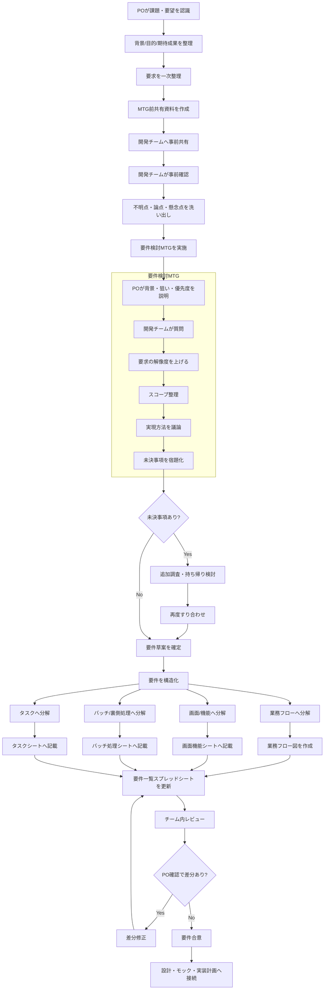

# 要件定義フロー（PO要求 → 開発MTG → 要件一覧スプレッドシート記載）

プロダクトオーナー（PO）が要求を上げ、開発チームと議論し、最終的に要件一覧スプレッドシートへ落とし込むまでの流れを詳細化したドキュメント。

このフローの目的は、要求をそのまま転記するのではなく、背景・課題・優先度・実現方法・未決事項を整理したうえで、開発可能な形へ分解して記録することにある。

---

## 1. 登場人物と役割

| 役割 | 主な責務 |
|------|----------|
| PO | 背景、目的、解決したい課題、優先度、期待成果を伝える |
| 開発チーム | 要求を具体化し、実現方法・画面・バッチ・タスクへ分解する |
| ファシリテーター/PM（いる場合） | 論点整理、宿題管理、合意事項の明文化を行う |

---

## 2. 全体像

---

## 3. フェーズ別の詳細フロー

## 3-1. POが要求を上げる

### 目的
- 「何を作ってほしいか」ではなく、「なぜ必要か」を共有する
- 開発チームが判断できるように、要求の背景を揃える

### POが整理して持ち込む内容
- 背景: なぜこの要求が出たのか
- 課題: 何が困っているのか
- 対象: 誰のための要求か
- 期待成果: どうなれば成功か
- 優先度: Must / Want / Nice to have
- 制約: 納期、工数、既存仕様、運用ルール

### この段階のアウトプット
- 要求メモ
- 期待成果の仮置き
- 論点になりそうな未確定事項

---

## 3-2. MTG前の事前整理

### PO側でやること
- 要求を一文で言えるようにする
- 課題と解決案を混同しない
- 要求の優先度を仮置きする

### 開発チーム側でやること
- 事前に読んで不明点を洗い出す
- 実装・運用・UI・データの観点で懸念を出す
- 似た既存機能や流用できる仕組みを確認する

### 事前に揃えておくと良い問い
- 誰が困っているのか
- 今はどう運用しているのか
- 何をもって完了とするのか
- 今回の開発期間でどこまでやるのか
- システムで解決すべきか、運用で補えるか

---

## 3-3. 要件検討MTG

### MTGの基本的な進め方

1. POが背景・課題・期待成果を説明する
2. 開発チームが質問して前提認識を揃える
3. 要求をユーザー行動や業務の流れに落とす
4. Must / Want を整理する
5. 実現方法を議論する
6. 未決事項を宿題として切り出す
7. 次回までの更新担当を決める

### MTGで必ず確認したい論点

| 観点 | 確認内容 |
|------|----------|
| 背景 | この要求はどの課題から来ているか |
| 対象ユーザー | 誰が使うのか、誰が困っているのか |
| 利用シーン | どのタイミングで使うのか |
| 完了条件 | 何ができれば要求を満たしたと言えるか |
| 優先度 | 今回絶対必要なものは何か |
| 代替案 | 画面、通知、バッチ、運用のどれで解決するか |
| 制約 | スケジュール、データ、権限、保守性の制約は何か |
| 未決事項 | 誰がいつまでに確認するか |

### MTGのアウトプット
- 合意した要件
- 保留した論点
- 宿題一覧
- 要件を記載する担当者

---

## 3-4. MTG後に要求を要件へ変換する

ここが重要で、MTGで出た会話をそのまま残すのではなく、開発物へ変換する。

### 変換の考え方
- 要求 → 業務フロー
- 業務フロー → 画面/機能
- 業務フロー → バッチ/裏側処理
- 画面/機能 → 実装タスク

### 例

| 会話上の要求 | 要件としての整理 |
|--------------|------------------|
| 進捗の遅れがすぐわかるようにしたい | 進捗一覧画面でステータス・遅延状態を可視化する |
| 不調なメンバーに早めに気づきたい | コンディション入力機能とチーム状態一覧を用意する |
| 誰が何を担当しているか曖昧 | タスク/プロジェクトごとに役割を割り当て、一覧で確認可能にする |

---

## 3-5. スプレッドシートに記載する

要件一覧テンプレートは、少なくとも次の4つの観点に分けて記載すると整理しやすい。

### 1. 業務フロー図
- ユーザーや管理者がどの順番で行動するか
- どのタイミングで入力・確認・通知・完了が発生するか
- 人の作業とシステム処理の境界

### 2. 画面機能シート

テンプレート上では、以下の粒度で記載する想定。

| 項目 | 例 |
|------|----|
| 画面名 | トップページ |
| 画面ID | S-01-01 |
| 分類 | 検索フォーム / 一覧表示 / 入力フォーム |
| 階層 | ユーザ機能 / 管理機能 / 申し込み など |
| 説明 | その画面で何をするか |
| 機能名 | エージェント検索 / 申し込み登録 |
| 機能ID | F101, F102 など |
| 備考 | 入力必須、権限、補足仕様など |

### 3. バッチ処理シート

裏側の自動処理がある場合は、以下を記載する。

| 項目 | 例 |
|------|----|
| バッチ処理名 | 申し込みデータ送信 |
| バッチ処理ID | B-001 |
| 処理概要 | 申し込みデータを集計して通知する |
| 処理サイクル | 日次 / 週次 / 月次 |
| 処理タイミング | 夜間 / 毎朝 / 締め時 |
| 機能名 | 申し込みデータ送信 |
| 機能ID | BF101 |

### 4. タスクシート

要件定義後の実作業に落とすため、以下の単位で記載する。

| 項目 | 内容 |
|------|------|
| 大項目 | 要件定義、設計、実装、テスト |
| 中項目 | 業務フロー作成、モック作成など |
| 小項目 | 個別画面、個別機能、提出物作成 |
| 提出物 | 業務フロー図、モック、要件一覧など |
| 担当者 | 誰が書くか |
| 該当week | いつやるか |
| 想定工数 | 見積もり |

---

## 3-6. レビューと合意

### チーム内レビューで見るポイント
- 課題と要件のつながりがあるか
- Must要件が抜けていないか
- 曖昧な表現が残っていないか
- 実装できる粒度まで落ちているか
- 画面とバッチと運用の役割分担が整理されているか

### PO確認で見るポイント
- 要求意図とズレていないか
- 優先度の解釈がズレていないか
- 今回やる範囲・やらない範囲が明確か

### 合意後の状態
- 要件一覧スプレッドシートが最新版になっている
- 未決事項の担当と期限が明確になっている
- 次工程（設計、モック、実装計画）へ渡せる

---

## 4. フローをさらに詳細化するときの切り口

このフロー図をさらに詳しくしたい場合は、次の軸で分解すると見やすい。

### A. 役割別に泳線で分ける
- PO
- 開発チーム
- PM/ファシリテーター
- スプレッドシート更新担当

### B. 成果物ベースで分ける
- 要求メモ
- MTGアジェンダ
- 議事メモ
- 業務フロー図
- 画面機能一覧
- バッチ処理一覧
- タスク一覧

### C. 意思決定ポイントを明示する
- 今回のスコープに含めるか
- MustかWantか
- 画面で実現するか、バッチで実現するか
- 宿題として持ち帰るか、その場で決めるか

---

## 5. 実際に使うときの最小テンプレ

以下の順で会話と記録を進めると、要件化しやすい。

1. POが「背景・課題・成功条件」を共有する
2. 開発チームが質問して曖昧さを潰す
3. 業務フローを先に描く
4. 画面機能とバッチ処理に分ける
5. スプレッドシートへ記載する
6. タスクに落として担当を決める
7. PO確認を通して確定する

---

## 6. まとめ

要件定義で重要なのは、POの要求をそのまま表に写すことではなく、MTGを通じて要求の意図を解像度高くし、業務フロー・画面機能・バッチ処理・タスクへ分解して、合意可能な形に変換すること。

要件一覧スプレッドシートは、会話の記録ではなく、合意済みの要件と実装可能な粒度の整理結果を書く場所として使う。
